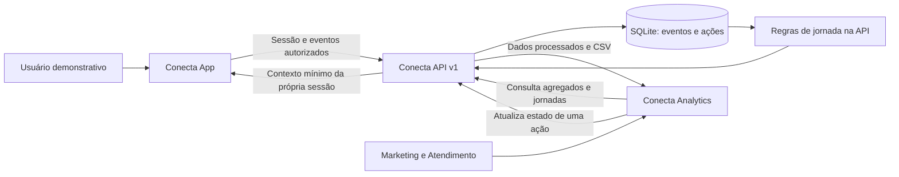

# Conecta App

### A experiência do usuário, em desenvolvimento

**Conecta transforma acessos em jornadas e jornadas em próximos passos relevantes.**

Frontend principal da Equipe 05 para o Hackathon Conexão Ancestral. Este repositório preserva o design informado pela equipe e acrescenta documentação profissional e instrumentação demonstrativa integrada.

> **Estado atual:** o layout, os estilos e o comportamento visual das telas principais foram preservados. `home.html` e `oportunidades.html` agora carregam `integration/tracking.js`, que registra categorias de páginas e cliques somente após adesão explícita. A integração detalhada também pode ser exercitada em **demo.html + integration/**. O login e a conclusão do cadastro continuam sendo simulações de interface, não autenticação real.

**Explore:** [Arquitetura](docs/ARCHITECTURE.md) · [Contrato da API](docs/API.md) · [Dados e métricas](docs/DATA-MODEL.md) · [Execução integrada](docs/INTEGRATION.md) · [Produto e identidade](docs/PRODUCT.md) · [Roadmap](docs/ROADMAP.md) · [Contribuição](CONTRIBUTING.md) · [Segurança](SECURITY.md) · [Verificação](docs/VERIFICATION.md)

## Abrir e testar

Com Node.js 24: execute npm ci e npm start. Abra **http://127.0.0.1:8080/demo.html** para a jornada integrada ou **http://127.0.0.1:8080/home.html** para o frontend original. Para registrar eventos, inicie primeiro a API em modo local, conforme o [guia dos três sistemas](docs/INTEGRATION.md).

Não existe URL de aplicação hospedada nesta entrega; links locais exigem os serviços em execução. GitHub contém os repositórios públicos.

## O desafio e a nossa resposta

O **Hackathon Conexão Ancestral**, da **Petronect**, com execução da **KODIE Academy**, propõe identificar os acessos ao Portal Petronect e usar esse conhecimento para apoiar o reengajamento de usuários. O material de abertura descreve uma lacuna entre contar cliques e compreender quem acessa, qual é o primeiro clique e com que frequência retorna.

O **Conecta** organiza esse problema em um ciclo demonstrável: **acesso → evento → jornada → sinal → próxima ação**. A proposta atende fornecedores e clientes na experiência de navegação e apoia Marketing e Atendimento na interpretação dos acessos.

**Todos os dados da nova API e do Analytics são fictícios. Não existe integração com o Portal Petronect.** As recomendações são regras transparentes para revisão humana, sem modelos preditivos, envio de campanhas ou promessa de aumento de conversão.

Fonte do escopo: material enviado pela equipe, _Slides_Abertura_Hackathon_Conexao_Ancestral.pdf_, páginas 2, 8, 9, 11 e 12, abertura de 14/09/2026. As páginas 8 e 9 sustentam o problema e o uso obrigatório de base simulada/protótipo demonstrável. O PDF original não é redistribuído aqui.

## Os três repositórios

| Repositório                                                                  | Responsabilidade                                                  | Execução local                  |
| ---------------------------------------------------------------------------- | ----------------------------------------------------------------- | ------------------------------- |
| [conecta-app](https://github.com/SouBeatrizKaroline/conecta-app)             | Frontend preservado e coleta consentida de eventos demonstrativos | http://127.0.0.1:8080/home.html |
| [conecta-api](https://github.com/SouBeatrizKaroline/conecta-api)             | Coleta, armazenamento, processamento, API e exportação            | http://127.0.0.1:3000/health    |
| [conecta-analytics](https://github.com/SouBeatrizKaroline/conecta-analytics) | Visão gerencial, jornadas, sinais e gestão de ações               | http://127.0.0.1:8081           |



O Analytics consulta a API por HTTP e atualiza sob demanda. Não há conexão direta dos frontends ao banco, WebSocket ou envio automático do backend ao painel.

## O que este frontend faz

| Área                                                     | Situação                                                                              |
| -------------------------------------------------------- | ------------------------------------------------------------------------------------- |
| Landing page, formulário, representantes e oportunidades | Herdados, ainda em desenvolvimento                                                    |
| Consulta de CNPJ na tela original                        | Usa BrasilAPI externa; não é integração Petronect                                     |
| Login e conclusão visual                                 | Estado local no navegador; não valida identidade no servidor                          |
| Jornada demonstrativa                                    | Cria sessão fictícia, registra acesso/cliques/interesse/conclusão e consulta contexto |
| Desativar coleta                                         | Remove eventos da sessão demonstrativa na API                                         |
| Instrumentação das telas principais                      | Ativa após consentimento; registra página/categoria, nunca o conteúdo dos formulários |

## Estrutura

```text
├── home.html / index.html / oportunidades.html  # Telas originais
├── script.js / styles.css                       # Código original
├── demo.html                                    # Fluxo integrado separado
├── integration/
│   ├── client.js                                # Cliente de sessão e eventos
│   ├── demo.js                                  # Interações explícitas da demo
│   ├── tracking.js                              # Instrumentação discreta das telas principais
│   └── demo.css                                 # Estilo exclusivo da demo
├── scripts/serve.js                             # Servidor local, arquivos permitidos
├── docs/                                        # Arquitetura, contrato e produto
└── .github/                                     # CI e modelo de PR
```

## Tecnologias e integração

HTML organiza as páginas; CSS3/Tailwind compõem o visual herdado; **JavaScript** implementa o comportamento. O cliente novo usa módulos ES e fetch, sem framework adicional. Tokens de sessão ficam somente no `sessionStorage`. Os campos de formulário, CPF, CNPJ, e-mail e texto livre nunca são lidos pelo cliente de eventos.

`integration/tracking.js` cria ou restaura uma sessão demonstrativa somente após o aceite existente na etapa LGPD. A instrumentação registra `page_view`, categorias de clique, preferência e conclusão; não lê nem envia busca, CNPJ, CPF, e-mail, telefone, nome ou texto livre. O primeiro repositório continua sendo a frente em desenvolvimento da equipe e seu design não foi alterado.

## Equipe 05

| Integrante                         |
| ---------------------------------- |
| Ines Correa Gomes Cardinot         |
| Beatriz Karoline Cordeiro da Silva |
| Kesly Aquinoã Ferreira da Silva    |
| Milene Arnaldo Ribeiro Belotto     |
| Ana Carolina Pereira Ruas          |

Os papéis individuais devem ser definidos pela equipe. Esta documentação não atribui funções ou resultados de seleção não confirmados.

## Desenvolvimento e licença

Leia [CONTRIBUTING](CONTRIBUTING.md) para branches, Conventional Commits, revisão e padrões. Veja [roadmap](docs/ROADMAP.md), [segurança](SECURITY.md) e [origem da implementação](docs/PROVENANCE.md). A licença MIT está **sugerida para decisão da equipe**, conforme [LICENSE](LICENSE); não foi aplicada retroativamente ao código herdado.
