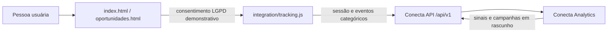

# Conecta App

Frontend demonstrativo do CONECTA para o Hackathon Conexão Ancestral, Petronect + KODIE Academy. A interface principal foi preservada: `index.html` agora é a Home pública do GitHub Pages, `home.html` permanece como compatibilidade, e a integração adicionada fica em `integration/`.

> Dados simulados. O app não coleta CNPJ, e-mail, CPF, campos de formulário, termos de busca ou dados reais do Portal Petronect. Ele envia somente eventos categóricos autorizados para a API.

## Como funciona



O rastreamento começa quando a pessoa marca o aceite LGPD no cadastro demonstrativo. A sessão fica em `sessionStorage` e acompanha a navegação para `oportunidades.html`. Ao retirar o consentimento, a API remove os eventos daquela sessão.

## Repositórios integrados

| Repositório | Responsabilidade | Local |
| --- | --- | --- |
| [conecta-app](https://github.com/SouBeatrizKaroline/conecta-app) | Portal/App e captura consentida | http://127.0.0.1:8080/index.html |
| [conecta-api](https://github.com/SouBeatrizKaroline/conecta-api) | API, banco, validação, métricas, campanhas | http://127.0.0.1:3000/health |
| [conecta-analytics](https://github.com/SouBeatrizKaroline/conecta-analytics) | Dashboard administrativo | http://127.0.0.1:8081 |

API publicada no Render: https://conecta-api-2x27.onrender.com

## Executar localmente

```sh
npm ci
npm start
```

Abra `http://127.0.0.1:8080/index.html`.

Por padrão, o rastreador aponta para `http://127.0.0.1:3000`. Para usar a API publicada, defina antes do módulo:

```html
<script>window.CONECTA_API_URL = 'https://conecta-api-2x27.onrender.com';</script>
<script type="module" src="integration/tracking.js"></script>
```

## Arquivos principais

| Arquivo | Função |
| --- | --- |
| `index.html` | Entrada pública do GitHub Pages, cadastro demonstrativo e consentimento |
| `home.html` | Cópia/compatibilidade da Home para links antigos |
| `oportunidades.html` | Lista de oportunidades e cliques de interesse |
| `script.js` | Comportamento visual original do app |
| `integration/client.js` | Cliente REST centralizado |
| `integration/tracking.js` | Captura consentida de page view, clique, preferência e conclusão |
| `demo.html` | Jornada isolada para teste técnico |

## Eventos enviados

| Tipo | Quando acontece |
| --- | --- |
| `page_view` | Entrada em `index.html`, `home.html` ou `oportunidades.html` com sessão ativa |
| `click` | Ações categorizadas como ajuda, exploração e navegação |
| `preference` | Clique em "Tenho Interesse" |
| `journey_completed` | Conclusão do cadastro demonstrativo |

Os valores de `page` e `target` seguem catálogo fechado da API. Isso evita envio de texto livre ou informação sensível.

## Verificação

```sh
npm run check
npm test
```

Verificado nesta integração: checagem de sintaxe do cliente/rastreador e 2 testes do cliente de eventos.

## Produção

Hospede os arquivos estáticos em um provedor web e configure a API em `window.CONECTA_API_URL`. No Render, a API atual está em `https://conecta-api-2x27.onrender.com`.

Outbound IPs compartilhados informados pelo Render para saídas do serviço: `74.220.50.0/24` e `74.220.58.0/24`. Eles não são exclusivos. Se algum serviço externo exigir allowlist única, será necessário contratar Dedicated IP no Render.

## Limites

O app é um protótipo de hackathon. O login visual segue demonstrativo no navegador; autenticação administrativa real fica no backend e no Analytics. Não há integração com Portal Petronect real, envio de campanha, CRM ou base produtiva.
