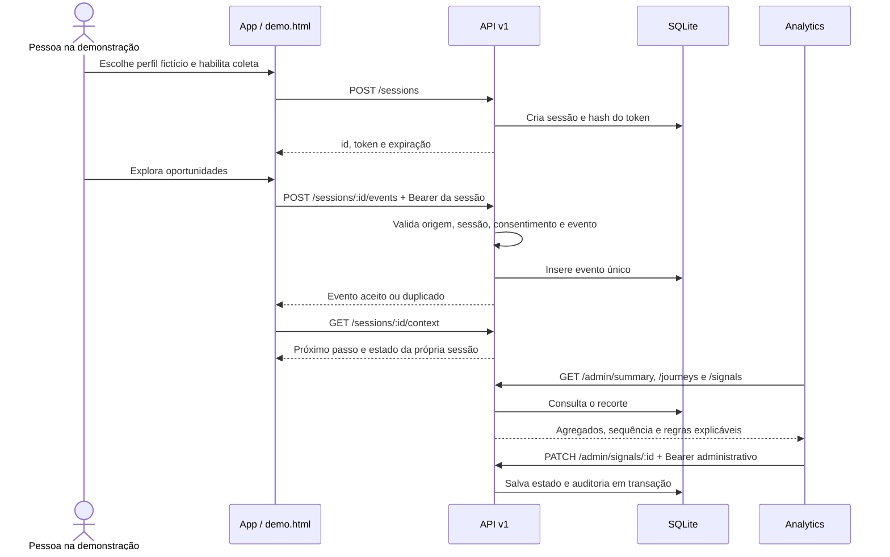

# Arquitetura do Conecta

## Decisão estrutural

Três repositórios independentes, uma API modular e um único banco no protótipo. Separar frontends e backend permite que a equipe evolua a experiência do usuário sem acoplar as telas administrativas. A API é a fonte de verdade para contagem, jornadas, sinais e ações.

| Camada                 | Implementação atual                                               | Limite                                             |
| ---------------------- | ----------------------------------------------------------------- | -------------------------------------------------- |
| Experiência do usuário | HTML, CSS/Tailwind e JavaScript herdados; SDK ES modules separado | Telas originais ainda não instrumentadas           |
| Transporte             | REST/JSON em /api/v1; UUID por evento                             | Sem fila offline ou entrega garantida              |
| Servidor               | Node.js 24, Express 5.2.1                                         | Um processo; limite de requisições em memória      |
| Persistência           | SQLite local, chaves estrangeiras, índices, transações e WAL      | Não indicado para múltiplas réplicas neste desenho |
| Processamento          | Agregação e regras determinísticas sob demanda                    | Sem pipeline assíncrono ou IA                      |
| Analytics              | HTML, CSS e JavaScript; API separada                              | Atualização manual; base demonstrativa pequena     |

### Por que SQLite nesta etapa?

A base de Ines utiliza Express e MariaDB. Preservamos o conceito de acesso, clique, preferência e relatório, mas redesenhamos a aplicação em torno de eventos. O SQLite nativo do Node 24 permite executar o protótipo sem instalar um servidor de banco. A migração de MariaDB **não é automática**: o esquema novo não importa cadastros antigos. MariaDB/PostgreSQL, migrações versionadas e execução assíncrona são evolução planejada. A decisão não representa uma arquitetura serverless ou de microsserviços.

## Fronteiras e fluxo

## Organização da API

- **src/app.js:** rotas, fronteiras HTTP, autorização e limites.
- **src/validation.js:** contrato de entrada, enums e filtros.
- **src/services/analytics.js:** métricas, jornadas, sinais e CSV.
- **src/db/database.js / schema.sql:** criação do banco e catálogo fictício.
- **scripts/:** configuração local e carga simulada idempotente.
- **test/:** contratos, segurança, persistência e fluxo funcional.

Separar controllers/repositories adicionais é apropriado quando o domínio crescer. Nesta versão as consultas são preparadas e parametrizadas; toda agregação parte de eventos ordenados por data e id. Horários iguais usam id como desempate determinístico, não como prova de ordem física dos cliques.

## Ambientes

**Local de desenvolvimento:** API em 127.0.0.1, token administrativo gerado localmente, escrita habilitada, catálogo exclusivamente fictício. Portas 3000, 8080 e 8081.

**Demonstração pública prevista:** API com DEMO_READ_ONLY=true, base fictícia dedicada, TLS no provedor e origens explícitas. A jornada não pode gravar nesse modo e deve ser apresentada como leitura. Publicar repositórios no GitHub não publica automaticamente os sites ou a API.

**Produção futura:** exige decisão sobre identificação, base legal, retenção, segregação por organização, autenticação de usuários/operadores, monitoramento e banco adequado à carga. Nada disso deve ser inferido a partir do login visual do frontend herdado.

## Evolução de contratos

Mudanças compatíveis podem adicionar campos de resposta. Remover campos, alterar semântica de eventos ou permissões exige nova versão, migração documentada e PRs vinculados nos clientes. A API deve ser entregue antes de clientes que dependam de novos campos. Use tags por repositório e uma tabela de compatibilidade na entrega.

Compatibilidade inicial: App 0.1.x ↔ API /api/v1 0.1.x ↔ Analytics 0.1.x.
