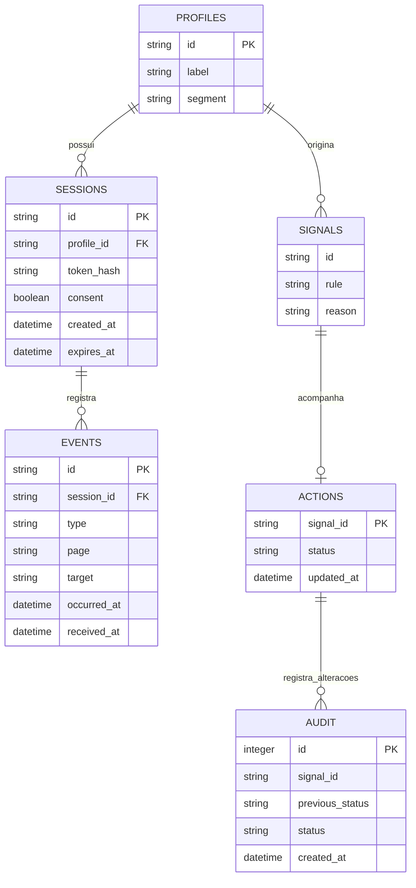

# Modelo de dados e métricas

SIGNALS é uma projeção calculada, não uma tabela física. A relação com ACTIONS usa a chave lógica perfil:regra; não há foreign key para uma projeção. Estados e auditoria permanecem mesmo que um sinal deixe de aparecer. O mesmo perfil/regra reutiliza o estado anterior quando voltar a atender à regra; episódios independentes ficam no roadmap.

## Campos e restrições

| Entidade  | Contrato                                                                                                                 |
| --------- | ------------------------------------------------------------------------------------------------------------------------ |
| Perfil    | demo-01 a demo-06, nome “Empresa demonstrativa NN”, segmento energia/tecnologia/servicos                                 |
| Sessão    | UUID gerado pelo servidor, token aleatório de 256 bits, somente hash persistido, expiração em 24h                        |
| Evento    | UUID v4 do cliente, único globalmente; sessão autorizada; tipo/página/alvo enumerados                                    |
| Datas     | ISO 8601 UTC; occurredAt vem do cliente, receivedAt do servidor; cliente pode desviar até 60s no futuro e 24h no passado |
| Ação      | open, planned, done ou dismissed; representa controle manual, não envio de mensagem                                      |
| Auditoria | estado anterior, novo estado e timestamp; operador único no protótipo, sem identidade individual                         |

Tipos: page_view, click, preference, journey_completed. Páginas: home, empresa, oportunidades, ajuda, preferencias. Alvos: page, explorar, ajuda, energia, tecnologia, servicos, concluir. Não há campo de texto livre ou metadados arbitrários.

Interesses são eventos explícitos de preferência; não são inferência sobre atributos sensíveis. Consentimento de coleta fica na sessão e é independente de marketing. A versão atual não modela autorização de contato e nunca envia comunicação.

## Contagem e interpretação

- **Perfis observados:** perfis distintos com pelo menos um evento no recorte.
- **Sessões:** ids de sessão distintos com evento no recorte. Reabrir a página demonstrativa cria nova sessão se iniciada novamente; não existe agrupamento automático por 30 minutos.
- **Retorno:** perfil com mais de uma sessão no recorte. Mede frequência observada, não retenção por coorte.
- **Primeiro clique:** primeiro evento click por sessão dentro do recorte. Pode não ser o primeiro clique de toda a sessão se o período excluir eventos anteriores.
- **Páginas:** quantidade de page_view; cliques em uma página não criam page_view automaticamente.
- **Conclusão:** pelo menos um evento journey_completed no recorte; ação manual da demonstração, sem comprovar cadastro real.
- **Sinais:** inatividade de 7 dias sem conclusão observada; ao menos dois cliques em ajuda; ao menos duas explorações sem conclusão observada. Os critérios são hipóteses de produto para o hackathon.

Filtros usam dias UTC inclusivos e até 366 dias. Padrão: hoje e 30 dias anteriores (31 datas de calendário). O Analytics mostra resultados do recorte e não deve chamar um sinal de abandono comprovado. Inatividade é medida entre o último evento no recorte e o relógio atual, inclusive ao consultar um período histórico.

## Consistência

Reenviar o mesmo UUID com o mesmo payload e sessão devolve duplicate=true sem aumentar contagem. Mesmo UUID com conteúdo/sessão diferente retorna 409. O banco usa índice único, consultas preparadas e transações para ação+auditoria e retirada de coleta+remoção de eventos.

Retirar coleta remove os eventos **daquela sessão**, não de todo o perfil fictício. Tokens ficam somente na memória dos navegadores, não no localStorage. Logs HTTP detalhados, IPs, coordenadas, gravação de tela e dados de formulários não são persistidos. O limite de requisições usa IP apenas em memória durante a janela de um minuto.
